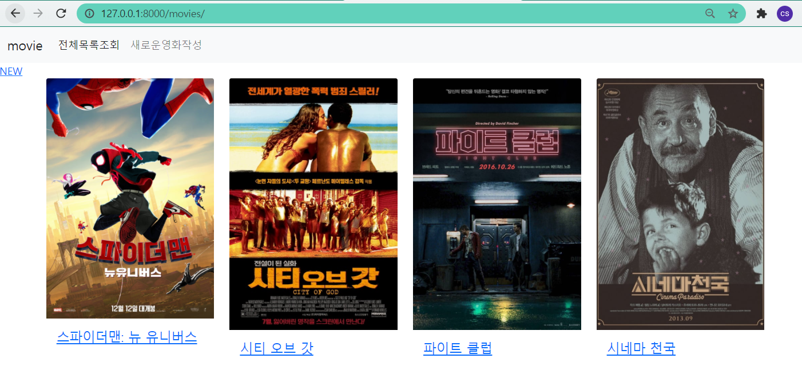
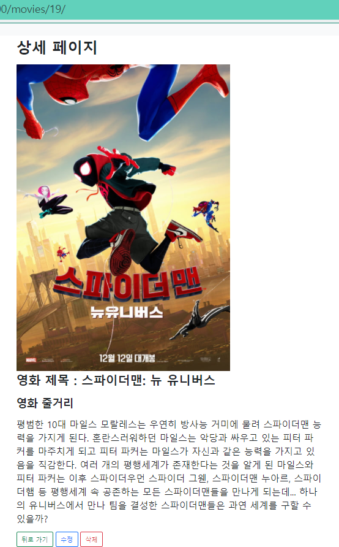
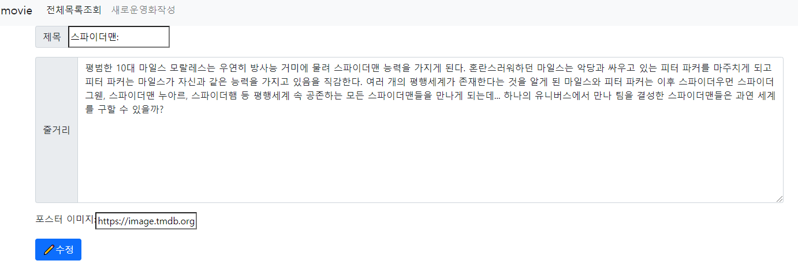
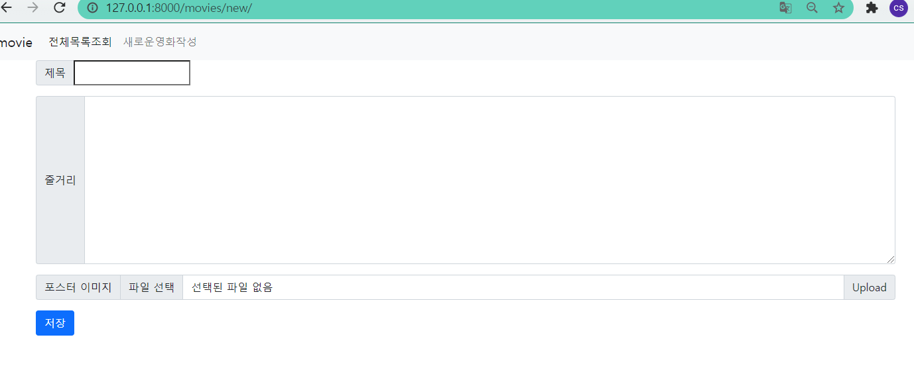

#  Project 04 (Pair-Programming)

> 프레임워크 기반 웹페이지 구현

**오랜만에 한 프로젝트 😊**


## 1. 나는 내비게이터 / 팀원은 드라이버

금요일 프로젝트 시간은 1시간 30분 밖에 되지 않았지만, 팀원과 합이 잘 맞아 시간 내에 명세 pdf에 나온대로  `urls.py` `views.py` `templates` 을 기본적인 구조를 다 잡을 수 있었다. (부트스트랩은 적용X)

네이버 룰렛으로 역할을 랜덤으로 정했지만, 타자가 느린 내가 내비게이터가 된 것이 다행이었다..그리고 redirect 나 return 쪽에서 헷갈리는 부분이 있었는데 팀원과 이야기하며 올바르게 작성할 수 있었다.

동일한 모니터를 보면서 같이해야 효과적일것 같았지만. 생각보다 착착 수행할 수 있어서 신기하고 재밌었다.

팀원에게 매우 고마울 따름이다...ㅎㅎ


## 2. 결과 화면

### index



> 목소리의 형태를 삭제 테스트 해보겠다고 그냥 지워버렸다....ㅠ


### 제목눌러서 상세 페이지



​	뒤로가기 - 목록조회(index)

​	수정 - 수정(edit)

​	삭제 - 삭제

### 수정버튼 눌러서 수정(edit)



### NEW



### Views.py

```python
from django.shortcuts import render,redirect
from .models import Movie


# Create your views here.
def index(request):
    movies = Movie.objects.all()[::-1]
    context = {
        'movies':movies,
    }
    return render(request, 'movies/index.html', context)

def new(request):
    return render(request, 'movies/new.html')


def create(request):
    movie = Movie()
    movie.title = request.GET.get('title')
    movie.overview = request.GET.get('overview')
    movie.poster_path = request.GET.get('poster_path')
    movie.save()
    return redirect('movies:index')

def detail(request, pk):
    movie = Movie.objects.get(pk=pk)
    context = {
        'movie':movie,
    }
    return render(request, 'movies/detail.html', context)

def edit(request, pk):
    movie = Movie.objects.get(pk=pk)
    context = {
        'movie':movie,
    }
    return render(request, 'movies/edit.html', context)

def update(request, pk):
    movie = Movie.objects.get(pk=pk)
    movie.title = request.GET.get('title')
    movie.overview = request.GET.get('overview')
    movie.poster_path = request.GET.get('poster_path')
    movie.save()
    return redirect('movies:detail', pk)

def delete(request, pk):
    movie = Movie.objects.get(pk=pk)
    movie.delete()
    return redirect('movies:index')
```

